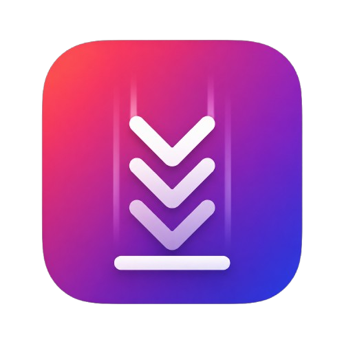

# ShowMeReels



ShowMeReels is a small Windows desktop viewer for short-form video feeds. It uses a native WPF shell with WebView2 inside it, so the app can stay lightweight while still keeping a persistent browser session for Instagram Reels or TikTok.

## Features

- Native Windows app built with WPF and WebView2.
- Persistent local browser session for Instagram/TikTok login.
- Global show/hide hotkey: `Ctrl+Shift+Space`.
- Tray-resident single-instance launcher.
- Layout menu for snapping the viewer left, center, right, or resetting size.
- Settings for playback speed, volume, seek bar, hardware acceleration, skip-seen behavior, and background playback.
- Optional local Android remote over ADB reverse with up, down, and pause/play controls.
- Local-only storage: settings and WebView2 profile live under `%LOCALAPPDATA%\ShowMeReels`.

## Requirements

- Windows 10 or later.
- .NET 8 SDK for development.
- Microsoft Edge WebView2 Runtime for running the app.
- Optional: Android platform tools (`adb`) for the phone remote.

## Build And Test

```powershell
.\scripts\test.ps1 -Configuration Release
.\scripts\build.ps1 -Configuration Release
```

For a runtime-specific local build:

```powershell
dotnet build .\ShowMeReels.App\ShowMeReels.App.csproj -c Release -r win-x64
```

## Run

For local development:

```powershell
dotnet run --project .\ShowMeReels.App\ShowMeReels.App.csproj
```

For normal use from this checkout:

```powershell
.\Launch-ShowMeReels.ps1
```

The launcher builds the Release app if needed, stops stale repo-local instances, and starts the current binary.

## Android Remote

The app hosts a local-only remote page at `http://127.0.0.1:18777/`. With a USB-connected Android device:

```powershell
.\Open-AndroidRemote.ps1
```

That script refreshes `adb reverse tcp:18777 tcp:18777` and opens the remote page on the phone. The server listens on loopback only.

## Privacy

ShowMeReels does not include account credentials, cookies, or browser profile data in this repository. Login state is stored by WebView2 under `%LOCALAPPDATA%\ShowMeReels\WebView2`, and app settings are stored under `%LOCALAPPDATA%\ShowMeReels\settings.json`.

The repository ignore rules intentionally exclude local settings, logs, build outputs, WebView2 profile folders, and common secret file formats.

## Notes

ShowMeReels is not affiliated with Instagram, TikTok, Meta, ByteDance, or Microsoft. Use it with the services' own terms and your own accounts.

## License

MIT. See [LICENSE](LICENSE).
